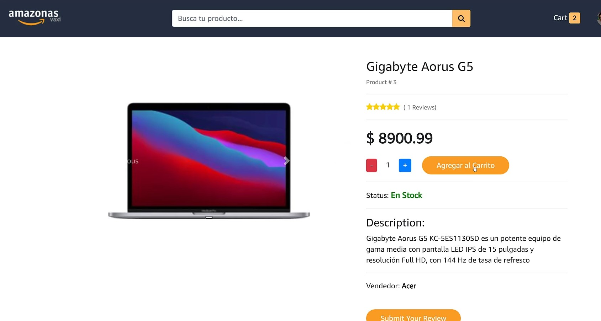
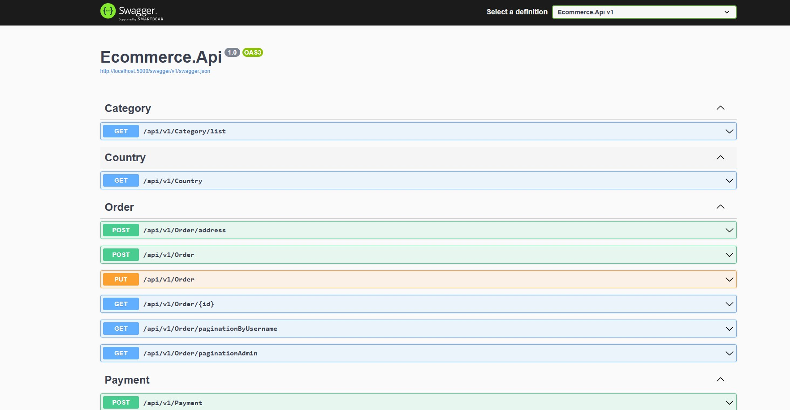

# Ecommerce Amazonas

Proyecto de Ecommerce desarrollado en la parte de Backend con .NET utilizando Entity Framework para realizar las migraciones a la Base de Datos en SQL Server que está en un contenedor de Docker. En la parte de Frontend se ha desarrollado con React 17

Se ha hecho uso de APIs externas como la de Stripe para implementar la funcionalidad de la pasarela de pagos. También se ha hecho uso de la API de Cloudinary, de Firebase y de SendGrid para envío de emails para recordar password o enviar emials de confirmación de orden de compra.

Se ha seguido una arquitectura para el backend de Clean Architecture

